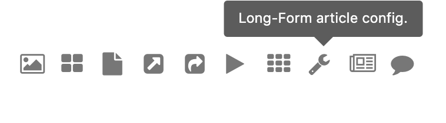
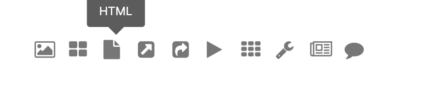
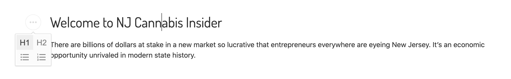
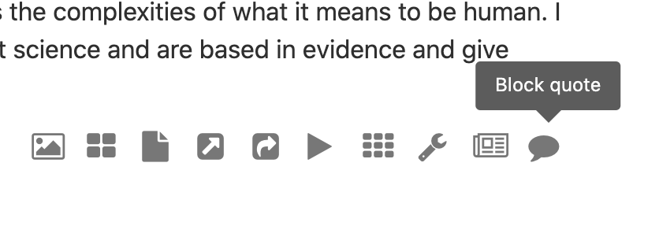

# How to create an NJCI post

In arc, choose create new story, then choose "longform"

## the other tabs

1\. The planning tab

-   headline: your headline

-   description: Start with "Issue #:" then add your subheadline

-   planned ready time: whenever you plan for it to be live

-   author: make it "Staff: NJ Cannabis Insider staff"

-   tag: add the @exfiba

2\. Circulate tab

-   choose NJ.com as the primary website 

-   choose /cannabis-insider as the primary section

3\. Featured Media

-   type: image

-   key: basic

-   choose an image that will be the giant first image

## Compose tab

-   add the headline and subheadline here again

-   delete the existing text and replace it with a long form story configuration. Do this by clicking the button that looks like a wrench. 

- 

    - Within the long form article configuration, choose the following settings:
        -   style: light

        -   label text: put a single space, this will allow the NJCI logo to show up

        -   episode: put a single space, this will allow the NJCI logo to show up

        -   editors note: nothing

        -   show author image: leave unchecked

        -   newsletter sign up: you can add this if you want to promote an event. Add a title, content (which should be date and details. Keep it very short) and a link to the webpage.

        -   about the authors: leave disabled

        -   about the reporting: leave disabled

        -   related articles: choose three. Only the first two show up on mobile so choose accordingly.

        - Save the config box and scroll down for the main article space

-   Next add a custom HTML block by selecting the button that looks like a piece of paper. 

-   

    -   In the HTML box, [place this HTML](./first-html-block.md). Copy all of it by using `cmd+A` then `cmd+C`. Later, if your articles look un-styled, this is the first thing to check. Did you get all the code? Be sure to save the box after inserting it. 

-   Next, add the Welcome section. Make the welcome headline an H1.

-   

    -   add your welcome section text. 

    -   If you want to make a line in the welcome section text, add a HTML block and type `
`

-   The following articles are all laid out the same: **medium photo, H1, H2, then the text**. It is important you keep that exact order. We will go through each of these.

    -   For the medium photo, click the longform article photo button. It looks like a newspaper. 

    -   

        -   in the dialogue box, select medium image, paste in the URL and add a caption. You can leave the credit blank. 

        -   To find the URL you need to paste in, go to photo center, locate your photo, select the pencil or edit icon in the corner then copy the PATH TO RESIZER url. 

        -   hit submit and exit the dialouge box.

    -   Then type in your section header. These are "inside this issue", "the lead" etc. Make the text an h1. This will style it and make it green. 

    -   Then type the article headline. Make it an h2

    -   Then paste in your text. 

    -   Optional features:

        -   add a small photo within the article. Just following the same instructions with the medium photo but choose small instead. Make sure there are a few paragraphs above and below the small image to maintain the flow. The style guide does not allow for a large photo, so please avoid using it. 

        -   line breaks. Add a custom HTML block then add `
` inside it

        -   block quotes: select the relevant text and click the speech bubble button. There is a place to credit the source. 

        -  

        - For the Power Players section, you may wish to use this graphic in place of a photo. [You can find it here in Photocenter](http://www.gulflive.com/resizer/wZ_Lib8IwdBwDSARHwYxs1gsS-4=/arc-anglerfish-arc2-prod-advancelocal/public/Y2UVV7L5KRBN7LXFHWLXJWPUTE.jpg)

-   At the very end of the issue, add in the contact and bio section. To do this, add an HTML block, [then paste this code in.](./last-html-block.md) Again, make sure you capture all of it. 
-   Be sure to save and preview before publishing. You're done.